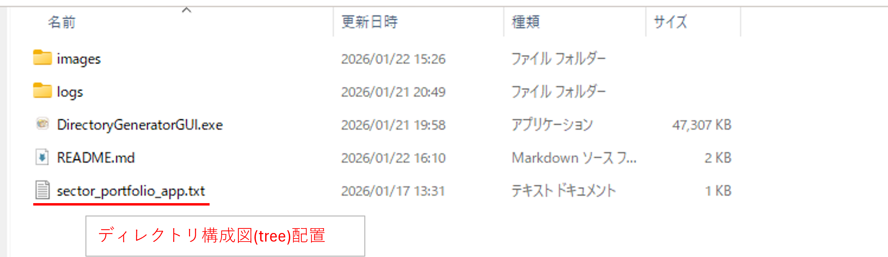
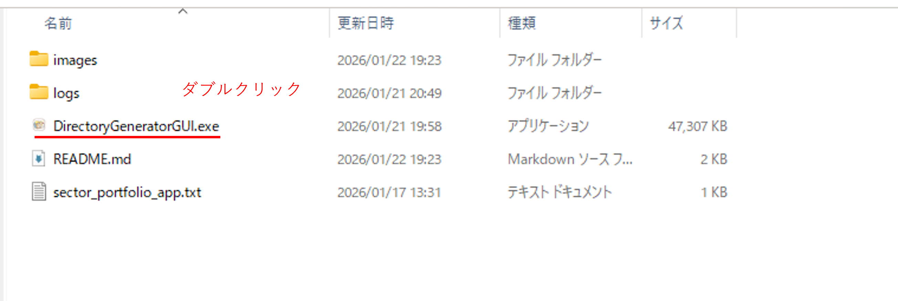
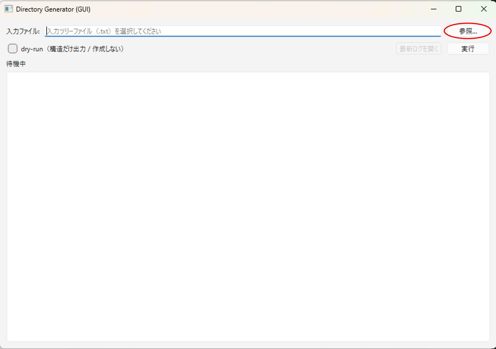
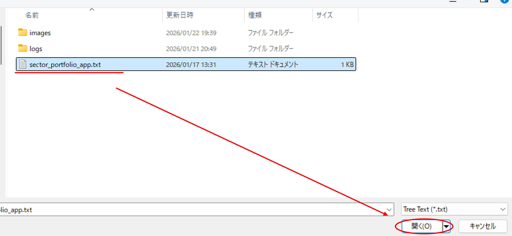
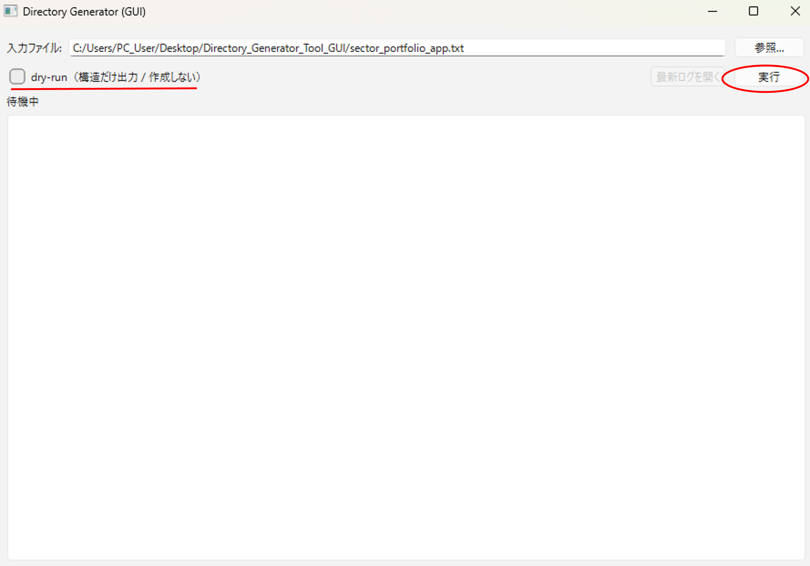
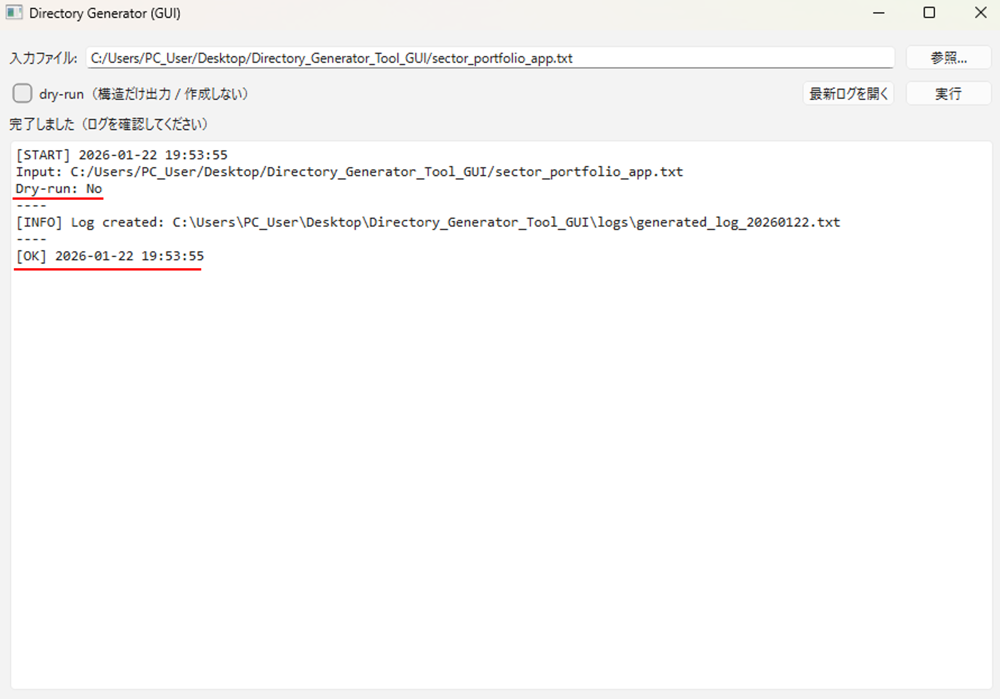
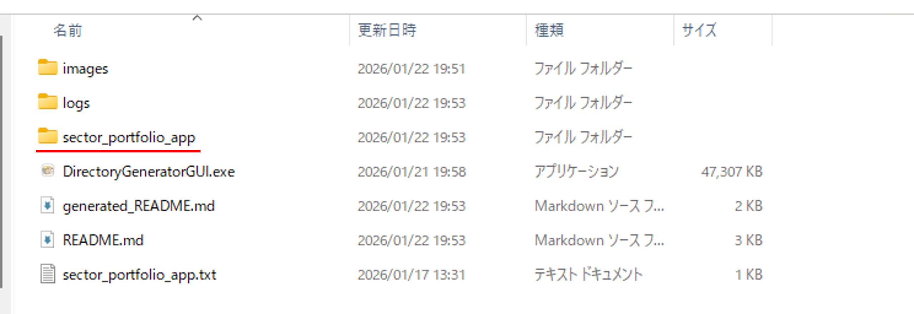

# 📁Directory_Generator_Tool_GUI
ツリー形式で記述したテキストファイルから、
実際のディレクトリ構成およびファイルを自動生成する Python ツールです。
プロジェクトの初期構成作成、フォルダ設計の標準化、作業の自動化を目的としています。
## ディレクトリ構成
```text
Directory_Generator_Tool_GUI/
├ DirectoryGeneratorGUI.exe　#実行ファイル
├ logs/   # 実行するとこのフォルダに「generated_log_20260121.txt」のようなテキストログファイル 出力される
├ images/ # 設定に使用した画像データ
├ sector_portfolio_app.txt　#作成したいディレクトリ構成のtreeファイル
├ desktop.ini  #アイコンの設定ファイル
└ README.md　# このシステムの説明
```
## 1. 使用方法
###　1.1 作成したいディレクトリ構成のツリーをテキストファイルで用意する
※ChatGPTで作成する→テキストファイルへコピーする。
見本例
sector_portfolio_app.txt
```text
sector_portfolio_app/  #作成されるフォルダ名になります。
├─ README.md
├─ requirements.txt
├─ main.py
├─ app/
│  ├─ __init__.py
│  ├─ constants.py
│  ├─ models.py
│  ├─ db.py
│  ├─ csvio.py
│  ├─ calc.py
│  ├─ export.py
│  ├─ report.py
│  ├─ table_model.py
│  ├─ plot.py
│  └─ ui_main.py
├─ data/
│  ├─ sample_holdings.csv
│  ├─ sample_fund_sector_allocations.csv
│  └─ sample_etf_sector_allocations.csv
├─ out/
│  └─ 
└─ build/
   └─
```
### 1.2 Directory_Generator_Tool_GUI内にsector_portfolio_app.txtを配置する。
<br>
※実際はディレクトリ内に配置しなくても大丈夫です。
### 1.3 DirectoryGeneratorGUI.exeをダブルクリック

### 1.4 GUI画面の参照をクリック

### 1.5 sector_portfolio_app.txtを選択して開く

### 1.6 dry-runの✅をはずし、実行を押す。

### 1.7 エラーメッセージ確認

### 1.8 ディレクトリが作成される。
<br>
※ディレクトリはコピーして使用してください。
### 2. ディレクトリアイコンを反映する
ディレクトリ内でコマンド入力
cd .
attrib +s .
attrib +h +s desktop.ini

